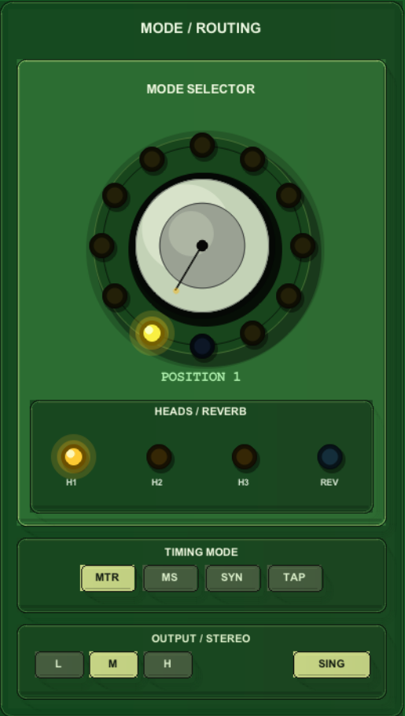
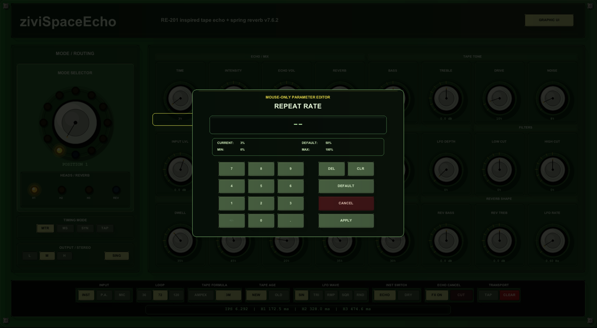

  

    
REAPER / JSFX · Echo de cinta · Reverb de muelles

    <h1>ziviSpaceEcho</h1>
    
<strong>Echo de cinta inspirado en RE-201 + reverberación de muelles para REAPER / JSFX.</strong>

    

      Un instrumento musical de delay de cinta para ecos dub, texturas de motor inestable,
      ambientes de muelles y performance con interfaz tipo gabinete.
    

    

      REAPER
      JSFX
      Tape Echo
      Spring Reverb
      Editor con mouse
    

    

      <a class="zivi-button" href="download/">Descargar JSFX</a>
      <a class="zivi-button secondary" href="installation/">Instalación</a>
      <a class="zivi-button info" href="manual/">Manual completo</a>
      <a class="zivi-button secondary" href="https://github.com/vicvalentim/ziviSpaceEchoJS">GitHub</a>
    

  

  

    
  

!!! note "Proyecto independiente inspirado en referencias históricas"
    ziviSpaceEcho no es una emulación oficial y no está afiliado con Roland, Boss, Cockos, REAPER ni con titulares de marcas.

## Qué es

**ziviSpaceEcho** es un plugin JSFX para REAPER orientado a ecos dub, texturas de delay de cinta, reverberación de muelles y modulaciones de motor inestable.

Combina un modelo de echo de cinta con múltiples cabezales, una rama paralela de reverb de muelles, una interfaz verde tipo gabinete y un editor numérico con mouse diseñado para flujos de trabajo en REAPER.

## Funciones principales

  
<strong>Echo de cinta multi-cabezal</strong> Tres cabezales virtuales de reproducción con selector de 12 posiciones.

  
<strong>Rama de reverb de muelles</strong> Rama paralela con dwell, decay, drip, bounce y grain.

  
<strong>Comportamiento de motor</strong> Repeat Rate, tiempo manual en ms, sincronía y tap tempo.

  
<strong>Carácter de cinta</strong> Drive, ruido, condición, fórmula, edad y longitud de loop.

  
<strong>Interfaz tipo gabinete</strong> Panel verde estilo hardware, perillas circulares y LEDs.

  
<strong>Editor con mouse</strong> Editor numérico diseñado para evitar conflictos con atajos de REAPER.

## Galería de la interfaz

  

    
    
<strong>Selector de modo</strong> 12 posiciones combinando H1, H2, H3 y reverb de muelles.

  

  

    
    
<strong>Editor con mouse</strong> Editor numérico en pantalla con aplicar, cancelar, default, borrar y limpiar.

  

  

    
    
<strong>Barra inferior</strong> Entrada, loop, fórmula de cinta, edad, LFO, interruptores y transporte.

  

[Abrir la galería completa](gallery.md){ .md-button .md-button--primary }

## Empieza aquí

- [Descargar el plugin](download.md)
- [Instalar en REAPER](installation.md)
- [Leer el manual completo](manual.md)
- [Consultar la referencia de parámetros](parameters.md)
- [Probar recetas de diseño sonoro](sound-design.md)
