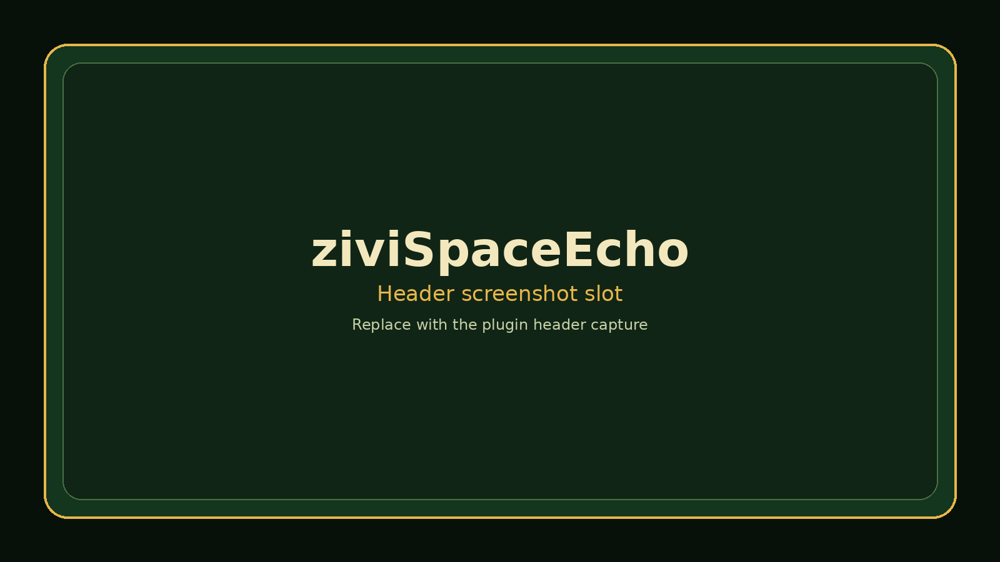
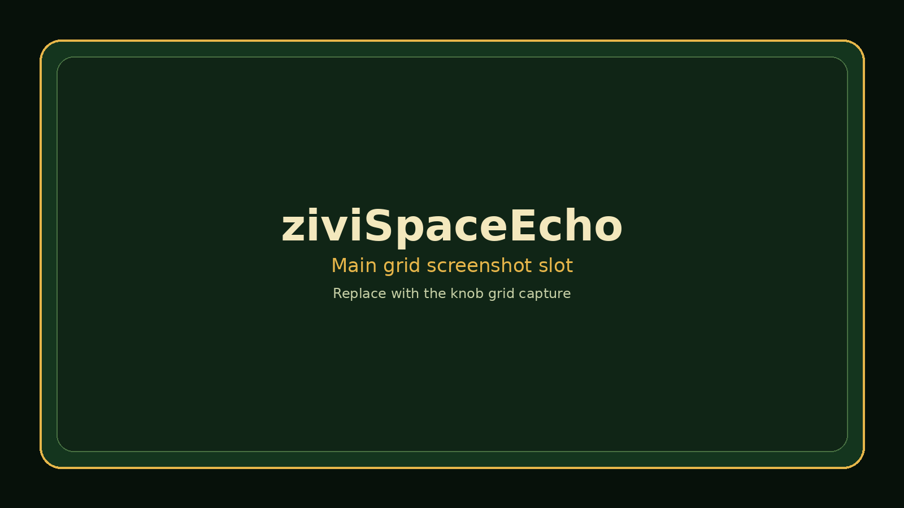
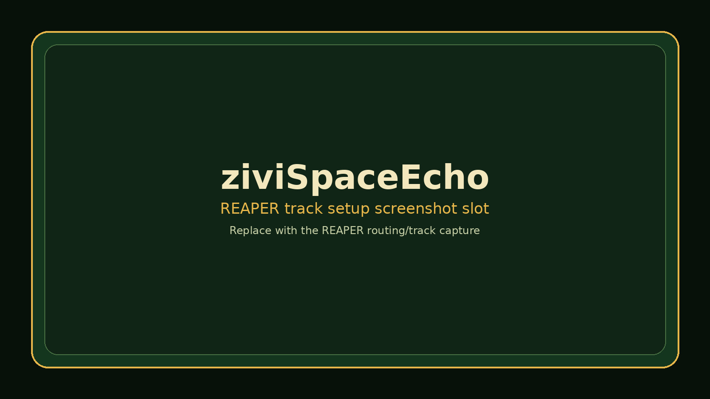

# Interface Gallery

Replace these images with your own exported REAPER screenshots when ready.

<div class="gallery-grid">
  <div class="gallery-card">
    
    <p><strong>Full interface</strong><br>`screenshot-main.png`</p>
  </div>
  <div class="gallery-card">
    
    <p><strong>Header</strong><br>`screenshot-header.png`</p>
  </div>
  <div class="gallery-card">
    
    <p><strong>Mode selector</strong><br>`screenshot-mode-selector.png`</p>
  </div>
  <div class="gallery-card">
    
    <p><strong>Main parameter grid</strong><br>`screenshot-main-grid.png`</p>
  </div>
  <div class="gallery-card">
    
    <p><strong>Mouse-only editor</strong><br>`screenshot-editor.png`</p>
  </div>
  <div class="gallery-card">
    
    <p><strong>Bottom control strip</strong><br>`screenshot-bottom-bar.png`</p>
  </div>
  <div class="gallery-card">
    
    <p><strong>REAPER track setup</strong><br>`screenshot-reaper-track.png`</p>
  </div>
</div>

## Capture checklist

Save your exported PNG files in:

```text
docs/assets/images/
```

Keep the exact file names above and the site will update automatically after commit/push.
