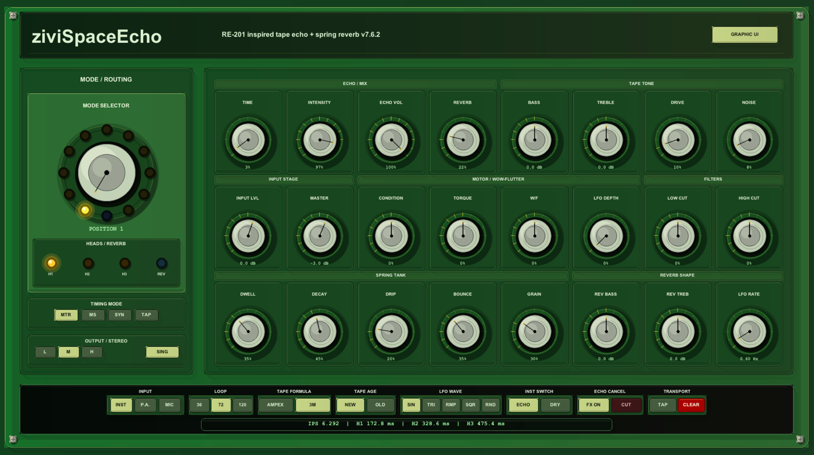

# Galeria da interface

Esta galeria documenta as regiões principais da interface do ziviSpaceEcho.

  

    
    
<strong>Interface completa</strong> Visão principal em estilo gabinete.

  

  

    
    
<strong>Seletor de modo</strong> 12 posições combinando H1, H2, H3 e reverb.

  

  

    
    
<strong>Editor por mouse</strong> Editor numérico na tela, sem uso do teclado físico.

  

